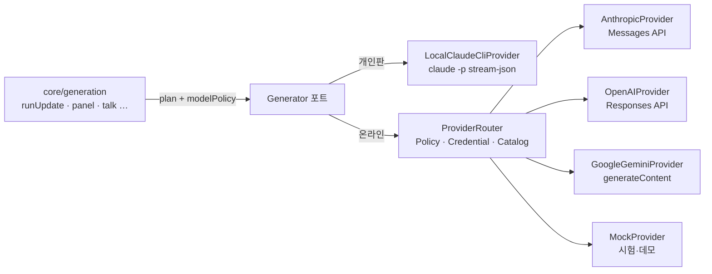

# AI Provider 추상화 설계

> 결정(2026-10-05, 사용자): **Claude · ChatGPT · Gemini 세 회사를 모두 지원**한다. 카탈로그(`config/models.json`)에 세 회사 × 세 등급이 있고,
> **회사는 사람이 고른다**(사용자 지시 2026-10-05 — «차례로 쓰지 말고 고르게»): 작품마다(«설정 → 이 작품에 쓸 AI 회사», 개인 작품만) > 비용 주체의 기본
> («내 계정 → 개인 작품에 쓸 AI 회사» · «관리 → 이 기관 작품에 쓸 AI 회사»). 수업 작품은 기관이 정한다(학생은 고르지 않는다). 아무도 고르지 않았을 때만
> 키를 넣어 둔 회사 가운데 하나로 간다(`ai/router.mjs`). 저장: `projects.model_policy.provider` · `users.settings.ai_provider`(migrations/006) · `organizations.settings.ai_provider`.
> 키마다 «연결 확인»(가장 싼 등급으로 아주 짧게 한 번) · «지우기».
> OpenAI 가격은 공식 페이지에 닿지 못해 2차 자료 기준 — 운영자가 맞춰 볼 것. 실제 키 연기 시험은 아직(사용자 확인 대기).

> 상태: **설계 v1 (2026-10-04)**. 구현: 계약 `ai/provider.mjs` · CLI `ai/local-cli.mjs` · Anthropic `ai/anthropic.mjs` · OpenAI `ai/openai.mjs`(공식 OpenAPI 명세 확인) · Gemini `ai/gemini.mjs`(공식 API 문서 확인). 모두 가짜 API 로만 시험 — 실제 키 연기 시험과 앱 연결(카탈로그 · credential)은 다음.
> 각 Provider 의 요청/응답 모양은 설계용 요약이다. **어댑터를 쓰는 시점에 공식 최신 문서로 다시 확인한다**(명세 부록 AD) —
> 모델 id·가격·폐기 일정은 바뀐다. 그래서 이 문서와 코드에는 실제 model id 를 박지 않고 **설정 데이터**로 둔다.

## 1. 목표와 경계

- Core 는 «이 계획(planCall 결과)을 어떤 등급의 모델로 실행해 달라»만 말한다. SDK·HTTP·인증·model id·응답 파싱·usage·오류 변환은 **어댑터**가 맡는다.
- 어댑터 = `fetch` 기반, **외부 SDK 없음**(의존성 0 유지, 오류·usage 정규화를 한 곳에서). 대가는 API 변화를 직접 따라가는 것 → 가짜 HTTP 서버로 계약 시험.
- 개인판(로컬)은 지금의 CLI 경로를 `LocalClaudeCliProvider` 로 감싸 **동작을 바꾸지 않는다**(구독 사용량 · 한도 물음 · 모의 응답).



## 2. 계약 (`ai/provider.mjs`, JSDoc)

```js
/**
 * @typedef {'anthropic'|'openai'|'google'|'local-cli'|'mock'} ProviderId
 * @typedef {'high_reasoning'|'balanced'|'fast'} ModelTier
 *
 * @typedef GenerateInput
 * @property {string} model                 // 해석이 끝난 실제 model id (Catalog 가 정함)
 * @property {string} systemPrompt          // planCall 이 만든 시스템 프롬프트(구획 그대로)
 * @property {string} userPrompt            // planCall 이 만든 사용자 프롬프트
 * @property {{ apiKey: string }} [credential]   // 복호화된 비밀 — 로그·오류·기록에 절대 싣지 않는다
 * @property {number} [maxOutputTokens]     // 없으면 catalog 의 값
 * @property {number} [temperature]
 * @property {AbortSignal} [signal]         // 취소
 * @property {number} [timeoutMs]
 * @property {(info: {chars: number}) => void} [onProgress]   // 스트리밍 중 heartbeat 용(본문은 넘기지 않음)
 * @property {Record<string, string>} [metadata]   // runId 등 추적용(원고 금지)
 *
 * @typedef GenerateResult
 * @property {boolean} ok
 * @property {string} text
 * @property {Usage} usage
 * @property {number|null} costUsd          // provider 가 준 값(CLI) 또는 catalog 가격으로 추정
 * @property {'provider'|'estimated'|'none'} costSource
 * @property {string} providerRequestId
 * @property {'stop'|'length'|'safety'|'other'} finishReason
 * @property {string} reason                // 실패 갈래(§4). 성공이면 ''
 * @property {string} errorSafe             // 원고·키가 섞이지 않은 짧은 문구
 * @property {number} retryAfterMs          // provider 가 알려 준 대기(있으면)
 * @property {object|null} limit            // 한도 정보(CLI rate_limit_event 등)
 * @property {number} elapsedMs
 *
 * @typedef Usage
 * @property {number} inputTokens @property {number} outputTokens
 * @property {number} cacheReadTokens @property {number} cacheWriteTokens
 * @property {number} reasoningTokens @property {number} totalTokens
 */
export interface AIProvider {
  id: ProviderId
  validateCredential(credential) → { ok, reason, errorSafe }   // 가벼운 호출(모델 목록/최소 생성)
  generate(input: GenerateInput) → GenerateResult              // **절대 throw 하지 않는다**(지금 call.mjs 의 계약 그대로)
  listModels?(credential) → [{ id, displayName }]              // 관리자 화면의 고르기 보조
}
```

## 3. Provider 별 대응(설계 요약 — 구현 시 공식 문서로 재확인)

| 항목 | Anthropic (Messages) | OpenAI (Responses) | Google Gemini (generateContent) |
|---|---|---|---|
| 끝점 | `POST https://api.anthropic.com/v1/messages` | `POST https://api.openai.com/v1/responses` | `POST https://generativelanguage.googleapis.com/v1beta/models/{model}:generateContent` (스트림 `:streamGenerateContent?alt=sse`) |
| 인증 | `x-api-key` + `anthropic-version` 헤더(워크스페이스에 묶이지 않은 키는 `anthropic-workspace-id` 도 — 키와 함께 저장, 비밀 아님) | `Authorization: Bearer` | `x-goog-api-key` |
| 시스템 프롬프트 | `system`(블록에 `cache_control` 로 캐시 지점) | `instructions` | `systemInstruction.parts[].text` |
| 사용자 프롬프트 | `messages:[{role:'user', content}]` | `input` | `contents:[{role:'user', parts:[{text}]}]` |
| 출력 상한 | `max_tokens`(필수) | `max_output_tokens` | `generationConfig.maxOutputTokens` |
| 본문 | `content[]` 의 text 블록 | `output[]` 의 `message` → `output_text` | `candidates[0].content.parts[].text` |
| 끝난 까닭 | `stop_reason`: `end_turn`/`max_tokens`/`refusal`… | `status`·`incomplete_details.reason` | `finishReason`: `STOP`/`MAX_TOKENS`/`SAFETY`… · `promptFeedback.blockReason` |
| usage | `input_tokens` `output_tokens` `cache_creation_input_tokens` `cache_read_input_tokens` | `input_tokens`(`input_tokens_details.cached_tokens`) `output_tokens`(`output_tokens_details.reasoning_tokens`) | `promptTokenCount` `candidatesTokenCount` `cachedContentTokenCount` `thoughtsTokenCount` |
| 요청 id | 응답 헤더 `request-id` | 응답 헤더 `x-request-id` | `responseId` |
| 개인정보 | — | `store: false` 로 응답 보관을 끈다 | 무료 등급은 데이터 활용 정책이 다르다 → **유료 키만 허용**(정책 결정 필요, SECURITY §7) |

공통 구현 원칙:
- **긴 출력은 스트리밍으로 받는다**(SSE). 2~5분 넘게 걸리는 호출이 중간 장비의 유휴 타임아웃에 끊기지 않게.
  받은 글은 메모리에 모으고 **끝에 한 번 저장**한다(부분 저장 없음 — 실패하면 기존 문서는 그대로). 진행은 글자 수만 heartbeat 로.
- 출력이 상한에 닿으면(`length`) 성공으로 저장하되 run 에 `finish_reason=length` 를 남기고 화면에 «잘렸을 수 있음»을 보인다.
  → 구현(2026-10-05): `/api/state` 가 지금 판을 지은 run 이 `length` 인 문서에 `truncated` 를 싣고, 문서 창이 알림을 띄운다(사람이 고쳐 새 판이 되면 내려간다).
- 프롬프트 캐시: 시스템 프롬프트(호출마다 같은 덩이)를 캐시 지점으로. OpenAI·Gemini 는 자동 캐시를 쓰고 usage 의 캐시 칸을 그대로 옮긴다.
- 타임아웃: 호출 상한(기본 30분 — 지금 `SE2_CALL_TIMEOUT_MS` 와 같은 뜻) + `AbortSignal` 로 취소.

## 4. 실패 갈래(오류 정규화)

지금 `call.REASONS` 를 **그대로 확장**한다(화면·작업이 이 값으로 갈라 움직이므로 이름을 바꾸지 않는다).

| 갈래 | 뜻 | Anthropic | OpenAI | Gemini | 작업의 다음 걸음 |
|---|---|---|---|---|---|
| `auth` | 키가 틀렸다/권한 없음 | 401 · 403 | 401 · 403 | 400 `API_KEY_INVALID` · 403 | 실패 · credential `invalid` 표시 · 관리자에게 알림 |
| `credit` | 잔액·결제 문제 | 400 «credit balance» · 402 | 429 `insufficient_quota` | 429/403 결제 관련 | 실패(재시도 없음) · 관리자 알림 |
| `rate` | 잠깐 밀림 | 429 `rate_limit_error` | 429 `rate_limit_exceeded` | 429 `RESOURCE_EXHAUSTED`(분당) | **자동 재시도**(지수 백오프 + `retry-after`) |
| `overloaded` (신규) | 공급자 과부하·일시 장애 | 529 · 500 · 503 | 500 · 503 | 500 · 503 `UNAVAILABLE` | 자동 재시도 |
| `quota-session`·`quota-week` | 구독 한도(CLI 전용) | — | — | — | 사람에게 물음(`waiting_for_user`) — 지금 그대로 |
| `model` | 그 모델 없음/권한 없음 | 404 | 404 `model_not_found` | 404 | 실패 · 카탈로그 점검 알림 |
| `invalid` (신규) | 요청 형식·입력 길이 초과 | 400 · 413 | 400 `context_length_exceeded` 등 | 400 `INVALID_ARGUMENT` | 실패 · «참조가 너무 많습니다» 안내 |
| `safety` (신규) | 안전 정책으로 거절 | `stop_reason=refusal` | `content_filter` | `SAFETY`·`blockReason` | 실패 · 요청 고치기 안내 |
| `timeout` | 상한 시간 초과 | | | | 1회 자동 재시도 후 실패 |
| `stopped` | 사람이 취소 | | | | 취소 |
| `empty` | 보낼 것/받은 것이 비었다 | | | | 실패 |
| `prompts` | 내장 프롬프트를 못 읽음 | | | | 실패(호출 전) |
| `other` | 그 밖 | | | | 1회 재시도 후 실패 |

`errorSafe` 에는 갈래별 고정 문구만 쓴다. provider 의 원문 메시지는 **서버 로그에만**(키·원고를 가린 뒤), 학생 화면에는 «잠시 후 다시 시도해 주세요» 수준.

## 5. 모델 등급(tier)과 카탈로그

- 화면은 `High Reasoning / Balanced / Fast` 만 안다. 실제 id 는 `model_catalog(provider, tier) → model_id`(관리자가 바꾼다, 부록 E).
- 카탈로그는 처음에 `ai/models.default.json` 같은 **심는 값**으로 시작해 DB 로 옮긴다. 각 줄에 가격·출력 상한·문맥 길이·활성 여부.
- 시나리오 5(명세 부록 Z): 관리자가 «OpenAI Balanced» 의 model id 를 바꿔도 Core·workflow 는 그대로.
- 개인판의 별칭(`opus`·`sonnet`·`fable`)은 CLI 가 받는 이름이다. 온라인 카탈로그와의 대응은 운영자가 정한다
  (예시 후보 — Anthropic: High Reasoning ← Opus 계열, Balanced ← Sonnet 계열, Fast ← Haiku 계열. `fable` 의 자리는 확인 후 결정).

### 5-1. 작업 종류별 기본 tier (명세 부록 F, 설정값)

단계의 기본 등급은 `config/workflows/story_creation.json` 의 단계마다 `tier` 로 있다(2026-10-05 구현). 운영자 · 기관 관리자가 단계 편집에서 고쳐 쓸 수 있고,
고른 경로는 «이번에 고른 것 · 에이전트 > 단계 기본 > 작품 기본 > 기관 기본» — 라이선스 허용 범위 안으로 잘린다. 개인판은 이 칸을 쓰지 않는다.

| 작업 | 기본 tier |
|---|---|
| 자료 분석(S02) · 서사 재료 · 모순 검사 | fast (모순 검사는 balanced 로 올릴 수 있음) |
| 기획서 · 기획 수정 · 세계관 수정 · 캐릭터 풀 · 주요 인물 · 회차/파트 | balanced |
| 대략 플롯 · 상세 플롯 · 캐릭터 아크 | high_reasoning |
| 장면 · 본문 · 합평 · 상세 플롯 수정 | balanced (사용자가 high_reasoning 선택 가능) |
| 논의(F-TALK) · 정리(F-THREADDOC) | balanced |
| 에이전트 준비(F-KIND · F-AGENT) | balanced |

### 5-2. 모델을 고르는 순서

- 개인판(지금 그대로): 이번에 고른 값 → 걸린 첫 에이전트 → 자리(slotModels) → 작품.
- 온라인: 이번에 고른 값(**정책이 허락할 때만**) → 걸린 첫 에이전트의 tier → 워크플로우 단계 기본 tier → 프로젝트 기본 → 기관 기본.
  모든 결과는 기관이 허용한 `provider × tier` 안으로 잘린다. 고른 경로는 `generation_runs.model_source` 에 남는다.
  - 허용 범위 = 지금 유효한 라이선스의 `allowed_providers` · `allowed_model_tiers`(비면 모두). 운영자가 `license.limits` 로 정한다(2026-10-05 구현).
  - 기관 기본 = `organizations.settings.ai_provider` · `ai_tier`. `ai_tier` 는 새 수업 작품의 시작 모델이 된다(Balanced → sonnet 별칭) — 학생이 고친 작품 값이 앞선다.
  - 화면(온라인)은 별칭 대신 등급 이름(High Reasoning / Balanced)만, 허용되지 않은 등급은 고르는 칸에서 뺀다.
- 합평 패널에서 걸린 사람들의 tier/provider 가 갈리면 지금처럼 «어느 모델로 모을지» 묻는다(학생 모드에서는 묻지 않고 정책값).

## 6. Credential 해석 (`online/credentials`)

```text
resolveCredential(project, provider):
  owner = project.organization_id ? ORGANIZATION(project.organization_id)
        : plan.managedAi            ? PLATFORM
        :                             USER(project.owner_user_id)
  row   = provider_credentials WHERE owner_type/owner_id/provider AND status='active'
  없으면 → reason 'credential_missing' (작업은 실패가 아니라 «연결 필요»로 멈춤, 학생에게는 «선생님께 문의»)
  secret = decrypt(row) — **worker 안에서만**, 호출 직전, 메모리에서만. 로그·예외 메시지에 싣지 않는다
```

- 저장: AES-256-GCM 봉투 암호화. 마스터 키 = 플랫폼 Secrets(`CREDENTIALS_KEY_v<n>`), 행마다 `key_version` → 키 교체 가능. 자세한 것은 [SECURITY.md](SECURITY.md) §5.
- 연결 테스트(`credential.test`): 가장 싼 호출 하나(또는 모델 목록) → 성공이면 `last_verified_at`, 실패면 갈래만 기록.
- 브라우저에는 `{ provider, status, keyHint:'…a1b2', lastVerifiedAt }` 만.

## 7. 비용 기록과 추정

- 호출마다 `generation_runs` 에 토큰 칸 전부 + `cost_usd`. CLI 는 `total_cost_usd` 를 주므로 `costSource='provider'`, API 는 카탈로그 가격으로 추정(`estimated`).
- 캐시 읽기/쓰기·추론 토큰 단가가 다르므로 칸을 나눠 둔다. 통화는 USD 로 저장하고 화면에서 바꾼다.
- 같은 입력 반복 감지: `prompt_sha256 + model_id` 가 같고 최근 성공 run 이 있으면 **관리자 지표로만** 센다.
  창작 결과는 자동 캐시하지 않는다(명세 부록 V-4 — 다시 생성은 사용자의 뜻이다).

## 8. Fallback

- 기본은 **자동 전환 없음**. 실패하면 갈래와 함께 멈추고 사람이 고른다(개인판의 «API로 갈아타기»와 같은 결).
- 기관 정책으로 «교육용 단순 작업(자료 분석 등)만» `Primary → Fallback` 자동 전환을 켤 수 있게 둔다(명세 부록 W). 바뀐 provider 는 run 에 남고 화면에 알린다.

## 9. LocalClaudeCliProvider (개인판)

- 지금 `call.runClaudeCall` 을 그대로 감싼다: `--system-prompt-file` · stream-json · `--strict-mcp-config --setting-sources '' --tools ''` · 빈 임시 cwd · 고삐(`MAX_CALLS`) · `classify()`.
- usage 는 지금처럼 `{ input, output, cacheRead, cacheWrite, costUsd }` 를 받아 공통 `Usage` 로 옮긴다. `limit`(rate_limit_event)은 그대로 넘겨 한도 물음이 돈다.
- 모의(`SE2_MOCK=1`)·시험 주입(`globalThis.__SE2_MOCK_FN`)도 그대로 — 시험 676 이 기대는 길이다.

## 10. 시험

- 어댑터마다 **가짜 HTTP 서버**(노드 `http`)를 띄워 성공·스트리밍·각 오류 상태·잘림·안전 거절·느린 응답·연결 끊김을 흉내 낸다. 망·키 없이 돈다.
- 계약 시험: 세 어댑터가 같은 입력에 같은 모양(`GenerateResult`)을 돌려주는지, `generate` 가 throw 하지 않는지, credential 이 오류 문구·로그에 새지 않는지.
- 실제 키로 도는 «연기 시험»은 수동(스테이징)으로만 — 저장소에 키를 두지 않는다.
