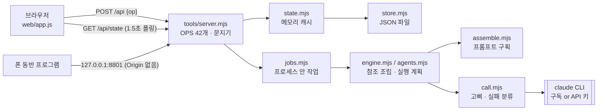
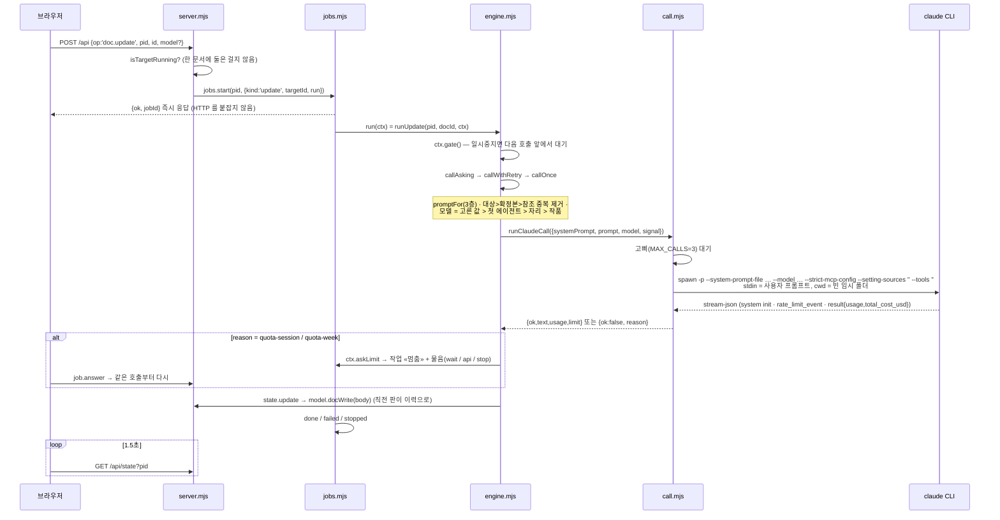

# 현재 아키텍처 — 스토리 엔진 개인판 (기준선)

> 기준 커밋 `f6b5dc6` (2026-09-29, «확정본은 줄의 토글로 … (시험 681)»), 원본 이력 37커밋을 그대로 가져왔다.
> 기준 시험: **통과 676 / 실패 0** — `node tools/test.mjs` (Linux, Node 22.22.0, 2026-10-04 실행).
> 이 문서는 «지금 있는 것»만 적는다. 바꿀 계획은 [ARCHITECTURE_TARGET.md](ARCHITECTURE_TARGET.md).

## 1. 한눈에

- **Node 22 ESM(`.mjs`), 외부 의존성 0, 빌드 단계 없음.** 화면은 바닐라 JS(`web/`).
- 한 프로세스가 HTTP 서버 · 작업 실행기 · 저장을 모두 맡는다. **메모리가 정본, JSON 파일은 그 그림자**다.
- AI 호출은 로컬 **Claude Code CLI**(`claude -p … --output-format stream-json`)를 자식 프로세스로 띄운다.
  돈은 그 PC 의 Claude 구독 사용량(또는 설정에 넣은 API 키)에서 나간다.
- 단일 사용자 · 로컬 전용(`127.0.0.1:8801`). 계정 · 권한 · 기관 개념이 없다.
- 폴더 하나가 전부다(USB 로 옮겨도 돈다). 원고는 `data/projects/<pid>.json` 하나에 프로젝트 하나.



## 2. 디렉터리

```
스토리 엔진 개인판.cmd   더블클릭 실행기(ASCII·CRLF) → tools/launch.mjs
README.md · DESIGN.md · 기획서.md   사용 설명 · 구현 계약 · 사용자 원문(정본)
.claude/launch.json     개발용 실행 설정(node tools/server.mjs, 8801)
tools/
  launch.mjs            CLI 탐색·설치 → 로그인 확인 → 서버 → 브라우저
  server.mjs            HTTP: POST /api(op 표) · GET /api/state · GET /api/download · 정적 파일 · 문지기
  hosting.mjs           (1차 구현에서 더함) 포트 · 붙을 주소 · 허용 호스트 · 스테이징 출입 열쇠 — 로컬 기본값은 그대로
  state.mjs             메모리 캐시 + update() 단일 문(쓸 때마다 파일 통째 저장)
  store.mjs             JSON 파일 저장(임시 파일 → rename) · 프로젝트 골격 · 옛 파일 보정 · newId · MODELS
  model.mjs             원소의 순수 동작(문서·이력·확정본·카테고리·스레드 가지·자료·에이전트·휴지통)
  engine.mjs            프롬프트 층 선택 · 참조 조립(callOnce) · 재시도 · 한도 물음 · 갱신/합평/논의/정리
  agents.mjs            종류 판정(F-KIND) · 자리 프롬프트 짓기(F-AGENT) · 자료 분석(S02)
  assemble.mjs          프롬프트 구획 조립 · 머리표 무력화 · 응답 후처리
  prompts.mjs (+ prompts.data.json)   내장 프롬프트 아홉 · 자리 목록
  call.mjs              CLI 호출 하나 · 동시 호출 고삐 · 실패 갈래 · usage 추출 · 모의 응답
  claude-cli.mjs        CLI 실행 파일 찾기 · 자식 환경(인증 갈래) · 공식 설치기
  auth.mjs              data/auth.json(무엇으로 부르나: auto/sub/api + API 키)
  jobs.mjs              작업 실행기(동시 실행 · 일시중지 · 이어 하기 · 삭제 · 한도 물음)
  books.mjs (+ books/)  작법서 그릇(지금 비어 있음 — 저작권 사유로 걷음)
  test.mjs              시험(순수 로직 + 실제 서버 + 화면-서버 배선 + 팔레트 + 이식성)
web/  index.html · app.js(1301줄) · style.css · tour.js · tour.demo.js
data/ (저장소 밖, .gitignore)   projects/<pid>.json · auth.json
tools/node/ · tools/claude/ (저장소 밖)   동봉 노드(v22.23.1 Windows) · 동봉 CLI
```

## 3. 실행 방법

| 목적 | 명령 | 비고 |
|---|---|---|
| 개인판 실행(윈도) | `스토리 엔진 개인판.cmd` 더블클릭 | 노드 탐색 → `launch.mjs` → CLI 설치/로그인 → `server.mjs`(`SE2_PORT=8801`, 브라우저 열기) |
| 개발 실행 | `node tools/server.mjs` | `127.0.0.1:8801` |
| 모의 실행(구독 소모 0) | `SE2_MOCK=1 SE2_PORT=8811 SE2_DATA_DIR=.tmp/box node tools/server.mjs` | AI 대신 결정적 가짜 응답 |
| 시험 | `node tools/test.mjs` | 스스로 `SE2_MOCK=1` + 임시 `SE2_DATA_DIR`. 포트 8899 를 쓴다 |

환경 변수(기준선): `SE2_PORT`(8801) · `SE2_DATA_DIR`(`<폴더>/data`) · `SE2_MOCK` · `SE2_MOCK_DELAY_MS` ·
`SE2_OPEN_BROWSER` · `SE2_MAX_CALLS`(3) · `SE2_CALL_TIMEOUT_MS`(30분, 최소 1분) · `SE2_KEEP_VERSIONS`(20) ·
`SE2_TRASH_DAYS`(30) · `SE2_LAUNCH_CHECK_ONLY`. 이번 1차 구현에서 더한 것은 [REPLIT_DEPLOYMENT.md](REPLIT_DEPLOYMENT.md) §3.

## 4. 모듈별 역할과 온라인화 분류

분류: **유지**(그대로) · **추출**(의미를 보존한 채 Core 로 옮김) · **수정**(포트/어댑터로 갈라 냄) · **대체**(온라인판에서 새 구현이 맡음) · **폐기**(없음).

| 파일 | 줄 | 하는 일 | 분류 |
|---|---|---|---|
| `model.mjs` | 460 | 원소의 순수 동작. 파일 I/O·호출 없음. 단 `store.newId`·`store.MODELS`·`books.bookText` 를 import 한다(→ 주입으로 끊을 것) | **추출** → `core/domain` |
| `assemble.mjs` | 114 | `buildSystem`/`buildUser` 구획 조립, `neutralize`, `specBlock`, `cleanResponse`, 규칙 문안 | **추출** → `core/prompt` |
| `engine.mjs` | 327 | `promptFor`(3층) · `slotModel` · `callOnce`(참조 조립·모델 결정) · `callWithRetry` · `callAsking` · `runUpdate`/`runPanelReview`/`runTalk`/`runThreadDoc` | **추출+분할**: 순수 부분 → `core/reference`·`core/generation`, 호출은 AI 포트로 |
| `agents.mjs` | 181 | 종류 판정·자리 짓기·자료 분석. `runClaudeCall` 을 직접 부른다 | **추출** → `core/generation` (AI 포트 경유로) |
| `prompts.mjs` + `.data.json` | 62 | 내장 아홉(`S02, F-UPDATE, F-TALK, F-THREADDOC, F-CONTRA, F-REVIEW, F-MERGE` + 제어 `F-KIND, F-AGENT`) | **추출** → `core/prompt` (온라인은 `prompt_versions` 로 버전화) |
| `call.mjs` | 317 | CLI 호출 · 고삐(`MAX_CALLS`) · `classify()` 실패 갈래 · usage 추출 · 모의 | **수정** → `LocalClaudeCliProvider` 어댑터 |
| `claude-cli.mjs` | 184 | CLI 찾기 · `childEnv` · 설치기 | **유지**(개인판 전용) |
| `auth.mjs` | 54 | `data/auth.json` — 모드와 **평문** API 키 | **유지**(개인판) / 온라인은 credential 계층이 **대체** |
| `state.mjs` | 46 | 메모리 캐시 · `update(pid, fn)` | **수정** → 저장 포트의 로컬 구현 |
| `store.mjs` | 162 | JSON 파일 저장 · 골격 · 옛 파일 보정 | **유지** → `LocalJsonStore` |
| `jobs.mjs` | 213 | 프로세스 안 작업 실행기 | **수정** → 작업 종류 레지스트리 분리, 로컬 실행기 유지 + 온라인 DB 큐 **신규** |
| `server.mjs` | 453 | HTTP · op 표 · 상태 뷰 · 내려받기 · 문지기 | **수정** → op 처리를 서비스로, 온라인 서버는 인증·권한을 앞에 |
| `launch.mjs` | 79 | 윈도 원클릭 실행기 | **유지** |
| `books.mjs` | 51 | 작법서 그릇 | **유지**(개인판 어댑터) |
| `web/app.js` 외 | ~1800 | 화면 · 튜토리얼 | **유지**(온라인 편집기 화면으로 재사용) |
| `test.mjs` | 1968 | 시험 676 | **유지 + 확장** |

**폐기할 코드는 없다.** 자동 집필은 이미 사용자 지시로 걷혔고(DESIGN §5), 남은 코드는 모두 쓰인다.

## 5. 데이터 구조 (프로젝트 JSON 하나)

`store.blankProject` 와 `store.loadProject`(옛 파일 보정)가 정의한다. 시각은 모두 **epoch ms 숫자**.

```text
project {
  id: 'p_…', name,
  spec: { outline, form, length },         // 사용자 원문 그대로. form 필수, length 비면 «상한 24화»
  standard, request,                       // 집필 기준 · 작품 요청사항(모든 호출에 실림 = 지속 조건)
  materials: [],                           // 옛 판 자료 — 읽을 때 «자료» 카테고리 문서로 옮기고 비운다
  docs: [doc], categories: [{ id:'c_…', name, createdAt }], threads: [thread],
  trash: [{ id:'t_…', at, kind:'doc'|'category'|'thread', from, title, payload, memberIds? }],
  jobs: [job],
  model: 'opus'|'sonnet'|'fable',          // 작품 모델(CLI 별칭). 빈 값 없음
  noCount: true,                           // 계량어 금지 규칙을 싣는가
  prompts: { <code>: { name, role, task, craft } },   // 작가가 고친 층
  slotModels: { <code>: model },                      // 자리별 모델
  crew: [{ id:'g_…', name, role, craft, model, createdAt }],   // 작가가 지은 에이전트
  agents: null | { __kind: '소설'|<종류>, <code>: { code, name, role, task, craft } },  // 지어진 층
  createdAt, updatedAt
}
doc {
  id: 'd_…'(옛 자료는 'm_…'), kind: 'doc'|'check'|'review', title, body,
  src: ''|<작법서 이름>,                    // 가리키는 문서 — 본문은 tools/books/*.txt
  isFinal, categoryId|null, orphanFrom?,    // 카테고리 삭제 시 돌아갈 자리
  request,                                  // 이 문서의 요청사항(지속, 갱신 때마다 «■ 이번 요청사항»으로)
  refIds: [docId], targetIds: [docId], agentIds: [agentId],   // 순서 있음 — 첫 에이전트의 모델이 쓰인다
  versions: [{ at, title, body }],          // «바뀌기 직전 판». 최대 20(오래된 것부터 버림). 번호 = 배열 index
  material?: true, createdAt, updatedAt
}
thread { id:'h_…', title, refIds, agentIds, messages: [{ id:'g_…', parentId, role:'user'|'assistant', text, at }], headId, createdAt, updatedAt }
job {
  id:'j_…', kind:'agents'|'update'|'talk'|'threaddoc', title, targetId,
  status:'running'|'paused'|'done'|'stopped'|'failed', step, stepAt, error,
  ask: null | { at, reason, resetsAt },     // 한도에 닿아 사람에게 물음
  startedAt, endedAt, docIds: []
}
data/auth.json { mode: 'auto'|'sub'|'api', apiKey }   // 평문. 화면에는 hasKey 만
```

관찰한 것(온라인 설계에 영향):

- **id** = `접두어_` + `Date.now()` 36진 + 순번 + 난수(0~1295). 한 프로세스 안에서만 확실히 유일하다. 스레드 메시지와 에이전트가 같은 접두어 `g_` 를 쓴다.
- **판에 고유 id 가 없다.** 현재 본문은 `doc.body`, 이력은 «직전 판» 배열이고 20개를 넘으면 앞에서 잘린다 → index 가 밀린다. 휴지통에 들어간 문서는 판 본문이 말라 있다(`lighten`).
- **참조는 id 배열**이고 판을 고정하지 않는다. 지운 문서를 가리키는 참조는 조용히 건너뛴다(`docsByIds`).
- **확정본은 참조/대상으로 고른 것만** «■ 확정본» 구획으로 승격된다. 예외: 자료 분석(S02)은 모든 확정본을 싣는다(`allFinals`).
- 카테고리 참조는 따로 없다 — 고를 때 그 안의 문서 id 를 펼쳐 담는다.
- `usage`(입력·출력·캐시 토큰·비용)는 CLI 결과에서 읽지만 **어디에도 저장하지 않는다**.

## 6. API (요약 — 전체 표는 [API.md](API.md) §1)

- `POST /api` `{ op, pid?, … }` → `{ ok, … }` — op 42개(프로젝트 · 프롬프트 · 자료 · 에이전트 · 문서 · 카테고리 · 스레드 · 휴지통 · 작업 · auth).
- `GET /api/state[?pid=]` — 목록 또는 프로젝트 전체 상태(문서 본문 + **모든 판의 본문**까지). 화면이 1.5초마다 받는다.
- `GET /api/download?pid=&kind=doc|cat|thread&id=` — `.md` 첨부.
- `GET /*` — `web/` 정적 파일.
- 실패는 대개 HTTP 200 + `{ ok:false, error }`. 없는 id 를 고치려 하면 조용히 `{ ok:true }` 가 돌아오는 op 가 많다.

## 7. AI 호출 흐름



- **실패 갈래**(`call.REASONS`): `quota-session` · `quota-week` · `rate` · `auth` · `credit` · `model` · `timeout` · `stopped` · `empty` · `other` (+ engine 의 `prompts`).
  구조화된 칸(`rate_limit_event`, `api_error_status`)을 먼저 보고 문구는 마지막에 본다. 재시도는 `rate`·`other` 만 한 번.
- **호출 종류(자리 코드)**: 문서 갱신 `F-UPDATE` · 모순 검사 `F-CONTRA`(확정본 우선 배치) · 합평 `F-REVIEW`(여럿이면 사람마다 1회 + `F-MERGE` 1회) ·
  논의 `F-TALK` · 정리 `F-THREADDOC` · 자료 분석 `S02` · 준비 `F-KIND`/`F-AGENT`(제어 호출, `runClaudeCall` 직행 — 한도 물음 없음).
- 프롬프트 = 시스템(에이전트 · 작법 · 확정본 규칙 · 계량어 금지 · 응답 형식) + 사용자(작품 규격 · 집필 기준 · 작품 요청사항 · 자료 · 참조 · 확정본 · 대상 · 대화 · 이번 요청사항 · 이번에 할 일).
  **상한 없음** — 어느 구획도 자르지 않는다.

## 8. 작업(Job) 흐름

- `jobs.start` 가 레코드를 `project.jobs` 에 넣고 **클로저 `run(ctx)`** 를 같은 프로세스에서 돌린다. 손잡이(AbortController·wake)는 메모리(`live` Map)에만 있다.
- `ctx = { step(name), gate(), askLimit(info), addDoc(id), signal }`. 일시중지는 «돌던 호출은 끝까지, 다음 호출 앞에서 선다».
- 삭제(`job.remove`) = abort + 목록에서 제거(만든 문서는 남는다). 중지 단추는 없다.
- 서버가 다시 뜨면 `healStale` 이 `running`/`paused` 를 `stopped` 로 내린다 — **도중의 작업은 이어지지 않는다.**
- 중복 방지: `isTargetRunning`(같은 대상에 running 작업이 있으면 거절), 에이전트 준비는 `building` Map 으로 한 벌만.

## 9. 저장 · 동시성

- `state.update(pid, fn)` 하나가 모든 고침을 맡는다: 메모리의 프로젝트를 고치고 **파일 전체를 다시 쓴다**(작업의 `step` 한 줄을 고쳐도).
- 쓰기는 임시 파일 → `rename`(윈도 EPERM 대비 재시도 → 최후에는 제자리 쓰기).
- 한 프로세스 · 한 스레드라서 차례가 보장된다. **프로세스가 둘이면 서로를 덮어쓴다**(캐시가 서로를 모른다).

## 10. 보안 모델(로컬 전제)

- 바인딩 `127.0.0.1` 고정. 문지기: Host 는 `127.0.0.1`·`localhost` 만(DNS 재바인딩 방지), `POST /api` 는 `application/json` 만(text/plain CSRF 방지),
  Origin 이 있으면 같은 자리(http · 루프백 이름 · 같은 포트)만. 폰 중계기(Origin 없음)는 통과.
- 인증 없음(그 PC 를 쓰는 사람 = 주인). API 키는 `data/auth.json` 에 **평문**, 화면에는 `hasKey` 만 내려간다.
- 요청 본문 크기 상한이 없다(로컬에서는 큰 자료를 붙여 넣기 위해). 온라인에 그대로 열면 위험하다 → [SECURITY.md](SECURITY.md).

## 11. 화면(web/)

- 상태 하나(`S`) + `h()` DOM 생성기 + `render()` 통째 그리기. 서버로 나가는 길은 `api()`·`pull()`·`download()` 셋뿐이고 튜토리얼이 셋 모두를 가로챈다.
- 1.5초 폴링(`pull`) + 1초 초침(작업 줄의 지난 시간). 상대 경로(`/api`)만 쓰므로 **어느 호스트에서 열어도 같은 출처로 붙는다**.
- 화면이 부르는 op 는 시험(«화면-서버 배선»)이 서버의 op 표와 맞춰 본다.

## 12. 시험(tools/test.mjs)

| 구획 | 무엇을 |
|---|---|
| 순수 로직 | 문서·카테고리·확정본·이력·휴지통·스레드 가지 |
| 프롬프트 조립 | 구획 순서 · 중복 제거 · 무력화 · 확정본 규칙 |
| 즉석 에이전트 읽기 | `readKind`/`readAgent` 형식 |
| 서버 통합 | 같은 프로세스에서 `boot(8899)` 후 실제 HTTP 로 op 를 두드림(모의 응답 함수 주입) |
| 검토·되짚기·새로 더한 것 | 회귀 방지(문지기 · 동시성 · 저장 미끄러짐 · 한도 물음 · 일시중지 등) |
| 화면-서버 배선 | `app.js` 가 부르는 op ⊂ 서버 op 표, 화면 규칙(소스 무늬 검사), 팔레트, 반 이름 |
| 프롬프트 정본 | 내장 아홉 · 작법 2,000자 이상 |
| 한 폴더가 전부다 | `.cmd` ASCII/CRLF · 박힌 경로 없음 · 다른 판 이름 없음 · data 는 저장소 밖 · README/DESIGN 문구 |

시험이 지키는 «코드 규칙» 몇 가지는 새 코드에도 걸린다(→ 루트 `CLAUDE.md` 에 옮겨 적었다):
`tools/`·`web/` 코드에 `StoryEngine`(붙여 쓴 것) 같은 다른 판 이름을 쓰지 않는다 · `C:\`·`/Users/` 같은 박힌 경로 금지 ·
`join(…'..')`/`resolve(…'..')` 금지 · `tmpdir()`/`homedir()` 는 `call.mjs` 만 · README 에 «라이선스»·«상점» 등 금지 · DESIGN 에 `cloud.` 금지.

## 13. 온라인화 관점의 한계 (요약)

| 영역 | 지금 | 온라인에서 필요한 것 |
|---|---|---|
| 저장 | 프로젝트 = JSON 파일, 메모리가 정본, 단일 프로세스 | PostgreSQL, 다중 인스턴스, 트랜잭션, 백업 |
| 판/참조 | 판 id 없음, 20개 상한, 참조는 판을 모름 | 판 테이블, 생성 당시 참조 판 기록, 참조된 판은 보존 |
| 생성 기록 | usage 버림, 무엇을 참조했는지 남지 않음 | `generation_runs` + 참조 스냅샷 |
| 인증/권한 | 없음 | 계정 · 세션 · 역할 · 기관 격리 |
| 자격증명 | 설치 하나에 평문 키 하나 | USER/ORGANIZATION/PLATFORM 소유, 암호화 저장 |
| AI | CLI 하나, 모델 별칭 하드코딩 | Provider 어댑터 3종 + 모델 tier 매핑(설정) |
| 작업 | 메모리 클로저, 재기동 시 «중지됨» | DB 영속 큐 + worker + 재시도/복구 |
| HTTP | 루프백 고정, 본문 상한 없음, 전체 상태 폴링(판 본문 포함) | 플랫폼 포트·호스트, 상한·속도 제한, 가벼운 상태 조회 |
