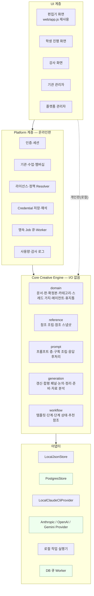
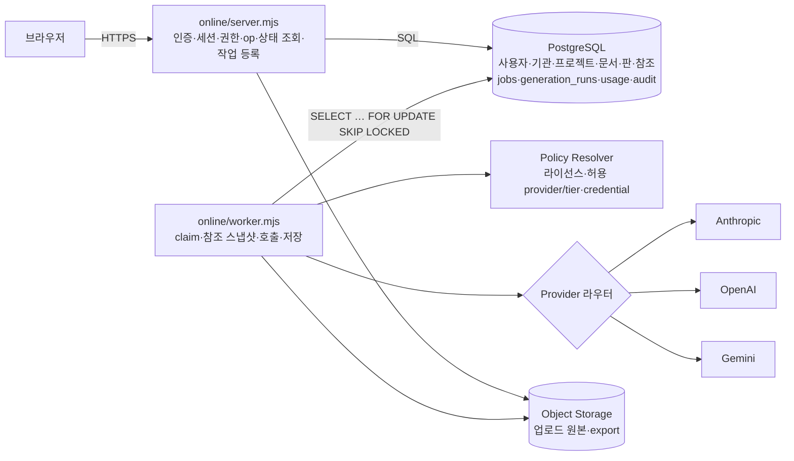
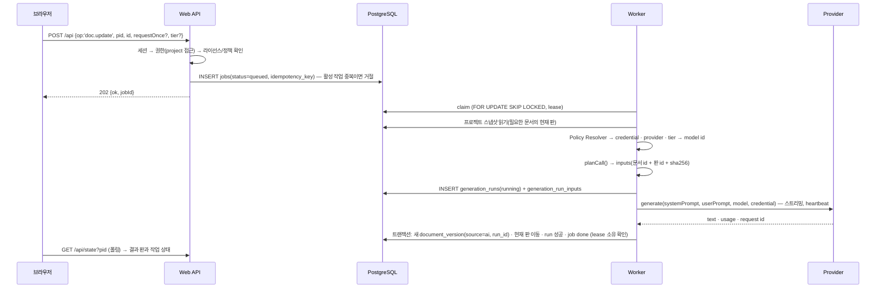

# 목표 아키텍처 — 하나의 Core 위에 개인판(로컬) · 온라인 개인판 · 교육기관판

> 상태: **설계 초안 v1 (2026-10-04)**. 구현하면서 고친다. 현재 구조는 [ARCHITECTURE_CURRENT.md](ARCHITECTURE_CURRENT.md).
> 근거: 통합 개발 명세서 v5/v6(이하 «명세») §0-C·§3·§43·§78·부록 D·M·Q·T·BD.

## 0. 지키는 원칙 (명세 우선순위 그대로)

1. 기존 창작 데이터 보존 > 2. 참조·버전·확정본 무결성 > 3. 사용자의 창작 판단권 > 4. 기관/사용자 격리와 보안 >
5. Provider 교체 가능성 > 6. AI 비용 통제 > 7. 교육 운영 편의 > 8. UI 미관.

- **한 번에 다시 쓰지 않는다.** 개인판은 매 단계 끝에 그대로 돌아야 하고 기존 시험이 모두 통과해야 한다.
- **Core 는 I/O 를 모른다.** 파일·DB·HTTP·AI SDK·플랫폼(Replit) 어느 것도 Core 에 들어오지 않는다.
- 자유형 문서 작업(원소)은 그대로 두고, 단계형 워크플로우는 **그 위에** 데이터로 얹는다.
- AI 결과는 곧바로 «진실»이 되지 않는다 — 판(version)으로 쌓이고, 사람이 고치고 확정·승인한다.

## 1. 세 계층



## 2. 디렉터리 계획

명세 §43 의 `packages/`·`apps/` 안을 이 저장소 사정에 맞게 옮겼다. **저장소 루트 = 개인판 폴더**라는 지금의 약속(USB 로 통째 옮김)을 깨지 않기 위해
`tools/`(개인판 앱)는 제자리에 두고, 새 것은 옆에 더한다.

```
core/                    (Phase 1) Core Creative Engine — 의존성 0, I/O 0
  domain/                project · document · version · category · thread · material · agent · trash · export
  reference/             참조 조립(planCall) · 참조 스냅샷 · 내용 해시
  prompt/                프롬프트 층(promptFor) · 내장 카탈로그 · 구획 조립(assemble) · 응답 후처리
  generation/            작업 종류별 실행 계획(update · panel review · talk · threaddoc · agents · study) · 재시도/한도 정책
  workflow/              (Phase 7) 템플릿 · 단계 · 단계 상태 전이 · 추천 참조
ai/                      (Phase 2) Provider 계층
  provider.mjs           계약 · 공통 실패 갈래 · usage 정규화
  catalog.mjs            (provider, tier) → model id 해석 — 값은 설정 데이터
  local-cli.mjs          현 call.mjs + claude-cli.mjs 를 감싼 LocalClaudeCliProvider
  anthropic.mjs · openai.mjs · gemini.mjs   fetch 기반(SDK 없음)
tools/                   개인판 앱 — launch · server · LocalJsonStore(state+store) · 로컬 작업 실행기 (지금 그대로)
online/                  (Phase 3~) 온라인판 앱
  server.mjs · worker.mjs
  db/                    pg 풀 · 마이그레이션 실행기 · repository
  auth/ tenancy/ credentials/ license/ policy/ audit/ usage/
migrations/              001_initial_schema.sql … (명세 부록 AH-8)
web/                     화면 — 개인판 그대로 + 온라인 화면(로그인·관리)을 같은 원칙으로
docs/                    이 문서들
```

명세 §43 과의 대응: `packages/core` = `core/`, `packages/ai` = `ai/`, `packages/storage/local-json` = `tools/state.mjs+store.mjs`,
`packages/storage/postgres` = `online/db/`, `packages/jobs/local` = `tools/jobs.mjs`, `packages/jobs/server` = `online/worker.mjs`,
`apps/desktop` = `tools/` + `스토리 엔진 개인판.cmd`, `apps/web` = `online/server.mjs` + `web/`, `apps/worker` = `online/worker.mjs`.

## 3. Core Creative Engine 추출안 (함수 단위)

> 의미를 바꾸지 않고 **자리만 옮긴다.** 옮긴 뒤 `tools/*.mjs` 는 Core 를 다시 내보내는 얇은 껍데기가 되어
> 기존 import 경로와 676개 시험이 그대로 돈다(시험이 소스 무늬를 읽는 곳은 경로만 함께 고친다).

| 현재 | → Core 모듈 | 옮길 것 | 끊을 I/O |
|---|---|---|---|
| `model.mjs` 문서 | `core/domain/document.mjs` | `findDoc` `docCreate` `docWrite` `docRestoreVersion` `docSetFinal` `docIsFresh` `docDiscard` `docDelete` `bodyOf` `DOC_NAME` `KIND_NAME` | `newId`(store) · `bookText`(books) → 주입 |
| `model.mjs` 판 정책 | `core/domain/version.mjs` | 판 쌓기 규칙(제목·본문이 바뀔 때만) · 상한 정책 `KEEP_VERSIONS` | env 읽기 → 설정 주입 |
| `model.mjs` 카테고리 | `core/domain/category.mjs` | `categoryCreate` `categoryDelete`(그릇만) `categoriesView`(가상 «새로 추가된 문서») `categoryDocIds` `INBOX` | — |
| `model.mjs` 스레드 | `core/domain/thread.mjs` | `threadCreate` `threadAddMessage` `threadEditMessage`(가지) `threadPath` `threadLeafOf` `threadSetHead` `threadSiblings` `threadIsFresh` `threadDiscard` `threadDelete` | — |
| `model.mjs` 자료 | `core/domain/material.mjs` | `materialsToDocs` `materialAdd` `materialDelete` `materialCategory` `firstLineName` | — |
| `model.mjs` 에이전트 | `core/domain/agent.mjs` | `agentCreate` `agentWrite` `agentDelete`(문서·스레드에서도 떼기) `agentsByIds` `findAgent` | `MODELS` → 모델 정책 주입 |
| `model.mjs` 휴지통 | `core/domain/trash.mjs` | `trashSweep` `trashRestore` `trashPurge` `lighten` `TRASH_DAYS` | env → 설정 |
| `model.mjs` 내려받기 | `core/domain/export.mjs` | `docToText` `categoryToText` `threadToText` `safeFileName` | — |
| `store.mjs` 골격 | `core/domain/project.mjs` | `blankProject` · 옛 파일 보정(`loadProject` 의 기본값 덮기 부분) | 파일 I/O 는 store 에 남김 |
| `engine.mjs` 층 | `core/prompt/layers.mjs` | `promptFor`(작가 고침 > 지은 것 > 내장, 칸마다) `slotModel` `promptView` | `BUILTIN` → 카탈로그 주입 |
| `assemble.mjs` | `core/prompt/assemble.mjs` | 전부(`buildSystem` `buildUser` `specBlock` `neutralize` `cleanResponse` 규칙 문안) | — |
| `prompts.mjs` | `core/prompt/catalog.mjs` | 코드 목록(`EDITABLE/CONTROL/VIEW_CODES` `AGENT_SLOTS` `SLOT_DUTY`) · 카탈로그 형식 | 파일 읽기는 어댑터로 |
| `engine.callOnce` 앞부분 | `core/reference/plan.mjs` | **`planCall()`** — 자료/확정본/대상/참조 가르기(대상 > 확정본 > 참조, 모순 검사만 확정본 우선), 중복 제거, 에이전트 자리(keepSeat), 모델 결정 순서, 프롬프트 조립 → `{systemPrompt, userPrompt, model, inputs[]}` | — |
| `engine.callWithRetry`·`callAsking` | `core/generation/policy.mjs` | 재시도할 갈래(`rate`,`other`) · 한도 물음 고리 | `auth` 직접 호출 → «갈아타기» 콜백 주입 |
| `engine.runUpdate`·`runPanelReview`·`runTalk`·`runThreadDoc` | `core/generation/*.mjs` | 실행 계획과 결과 반영 규칙 | `state` 직접 호출 → 저장 포트 |
| `agents.mjs` | `core/generation/agents.mjs` · `study.mjs` | `prepareAgents`(판정 1회 · 일곱 자리 · 2,000자 하한 · 중복 짓기 방지) `runStudy` `readKind` `readAgent` `agentsReady` | `runClaudeCall` 직행 → AI 포트 |

### 3-1. 포트(Core 가 바깥에 요구하는 것)

```js
// 모두 JSDoc 으로 계약을 적는다(빌드 없음). 로컬판과 온라인판이 각자 구현한다.
ProjectStore   { get(pid), update(pid, fn), create(fields), remove(pid), list() }   // 로컬: state+store, 온라인: Postgres UoW
Generator      { generate({ systemPrompt, userPrompt, model, signal, metadata }) → GenerateResult }  // 로컬: CLI, 온라인: Provider 라우터
JobContext     { step(label), gate(), askLimit(info), addDoc(id), signal, checkpoint: { get(), set(v) } }
RunRecorder    { record({ plan, result, jobId }) }   // 생성 기록. 로컬: 아무것도 안 하거나 가벼운 로그, 온라인: generation_runs
Ids / Clock    { newId(prefix), now() }              // 시험에서 결정적으로
BookSource     { text(src) }                          // 작법서(가리키는 문서) 본문
PromptCatalog  { builtin(code) → { name, role, task, craft, version } }
```

### 3-2. `planCall()` — 참조 스냅샷이 태어나는 자리

지금 `callOnce` 는 «조립 → 호출 → 후처리»를 한 함수에서 한다. 조립 부분을 순수 함수로 떼어 내면
**무엇을 실었는지(inputs)** 를 호출 전에 손에 쥘 수 있다. 이것이 `generation_runs` 의 참조 스냅샷이 된다.

```text
planCall(project, { code, refIds, targetIds, agentIds, request, taskExtra, materials, allFinals,
                    talk, noCount, finalFirst, keepSeat, extraTargets, modelPick })
 → { code, prompt: { layer: 'override'|'generated'|'builtin', checksum },
     model: { value, source: 'pick'|'agent'|'slot'|'project' },
     systemPrompt, userPrompt,
     inputs: [ { role: 'material'|'final'|'target'|'reference'|'extra'|'talk',
                 docId?, versionId?, title, chars, sha256 } ],
     request }
```

- 로컬판: `versionId` 는 없고(판 id 가 없다) `sha256` 과 `updatedAt` 으로 «그때 그 글»을 확인한다.
- 온라인판: 문서의 현재 판 id(`current_version_id`)를 함께 적는다 → 명세 §13 «세계관 v3 를 보고 만들었다»가 성립.

## 4. 온라인 실행 구조



- 웹과 worker 는 **다른 프로세스**다. 둘 다 stateless 에 가깝고, 상태는 모두 DB 에 있다(명세 0-G).
- 브라우저는 작업을 등록하면 곧바로 `jobId` 를 받는다. 결과는 폴링(지금의 1.5초 방식)으로 본다 → 필요해지면 SSE(`LISTEN/NOTIFY`).
- Redis 는 들이지 않는다(명세 §44). 동시 worker 가 늘고 DB 큐가 병목임이 측정되면 그때 검토한다.

### 4-1. 생성 한 번의 흐름(온라인)



실패하면: 문서는 손대지 않고(새 판을 만들지 않음) `generation_runs.status=failed` + 안전한 오류 코드, 작업은 재시도/실패/사람에게 물음([JOB_SYSTEM.md](JOB_SYSTEM.md)).

### 4-2. Policy Resolver (명세 부록 Q)

```text
입력: 요청한 사용자 · 프로젝트(owner, organization_id, class_id) · 작업 종류/단계 · 고른 provider/tier(있으면)
1) 접근: 사용자가 이 프로젝트에 쓸 권한이 있는가(소유자 / 같은 기관의 허용된 역할)
2) 라이선스: 기관 프로젝트면 유효 라이선스(기간·상태·좌석·허용 workflow) — **AI 작업마다 재검증**
3) 비용 주체: organization_id 있음 → ORGANIZATION / 없음 → USER / (향후) 요금제가 managed → PLATFORM
4) Provider/Tier: 고른 값(정책이 학생 선택을 허용할 때만) > 걸린 에이전트 > 단계 기본 tier > 프로젝트 기본 > 기관 기본
   — 기관이 허용한 provider/tier 집합 안에서만
5) Credential: 그 주체의 그 provider 활성 credential(없으면 «연결 필요» — 학생에게는 «선생님께 문의» 수준의 말만)
6) 모델 ID: model_catalog(provider, tier) → 실제 model id (운영 설정, 코드에 박지 않음)
출력: { allowed, reasonCode, ownerType, ownerId, credentialId, provider, tier, modelId, limits }
```

## 5. 워크플로우(Phase 7) — 데이터로 정의

- 기본 템플릿 `story_creation` 16단계(명세 부록 L). 단계 = `{ key, title, order, outputType, promptKey, task, defaultRequest, defaultTier, teachingNote, inputs[] }`.
- **단계는 새 «작법 프롬프트»가 아니다.** 현 원칙(«작법은 프롬프트가 아니라 문서다», DESIGN §4)을 지켜 `F-UPDATE` 위에
  «무엇을 만드는 단계인가»(task) · 기본 요청 · 추천 참조만 얹는다. 작법은 문서(작법서)·에이전트·집필 기준이 든다.
- 추천 참조: `stage_inputs`(이 단계는 앞 단계 X 의 산출 문서를 참조/대상/확정본으로) → 후보를 **체크된 채로 보여 주되 사용자가 확인**한다(명세 §26).
- 단계 상태(`project_stage_states`): `not_started → ready → generating → draft → needs_revision ↔ draft → approved` (+ `blocked`, `skipped`).
  **`approved`(이 단계 산출물로 승인) 와 `isFinal`(참조에서 최우선 사실) 은 다른 개념**이다(명세 §10). 승인 때 확정본 켜기를 «제안»만 한다.
- 요청사항 두 갈래(명세 부록 K): **일회성**(`requestOnce` — 이번 실행에만, `generation_runs` 에만 기록) /
  **지속**(문서의 `request` = 이 문서를 다시 쓸 때마다, 프로젝트의 `request` = 모든 호출). 새 테이블 없이 지금 모형에 그대로 얹힌다.
- 재진입: 어느 단계든 다시 생성 가능(새 판이 쌓일 뿐). 앞 단계가 바뀌면 뒤 단계에 «앞 단계가 바뀜» 표만 단다(자동 재생성 없음).

## 6. 교육 UX — AI 가 일하는 시간 = 그 작업의 작법 강의 시간

- 작업(job)은 단계(stage)를 안다 → 그 단계의 `teaching_note` 를 **강사 화면**의 «지금 강의 포인트»로 띄운다.
  기관 설정이 허락하면 학생 화면에도 «미니 강의 카드»(`student_note`)를 띄운다.
- 학생 화면은 «AI 가 기획서를 발전시키고 있습니다 · 시작 18:42» 정도만 보인다. **다음 산출물을 미리 만들게 하지 않는다**(명세 0-O·§23·부록 S).
- 결과가 오면 «방금 배운 기준으로 읽기» → 채택/수정/폐기 → 확정·승인 → 다음 단계.
- 학생에게 횟수·크레딧·비용을 보여 주지 않는다. 비용은 관리자 화면에서만(명세 §19·부록 I).

## 7. 개인판(로컬)과의 관계

- 개인판은 계속 **제품**이다: 로컬 JSON 저장 · CLI Provider(구독) · 프로세스 안 작업 실행기 · 폰 동반 프로그램(127.0.0.1:8801 API 유지).
- Core 를 공유하므로 참조·확정본·이력·논의·합평·모순 검사의 의미가 온라인과 같다.
- 개인판에도 API Provider(BYOK) 를 선택지로 줄 수 있다(로컬 키는 지금처럼 `data/` 안에) — 우선순위 낮음.
- 작품 이동(명세 §40): `story-project` 묶음(project.json + documents/versions/threads/metadata) 내보내기/가져오기로 로컬 ↔ 온라인을 잇는다(Phase 9).

## 8. 기술 선택과 까닭

| 영역 | 선택 | 까닭 / 대안 |
|---|---|---|
| 언어·런타임 | **Node 22 ESM `.mjs`, 빌드 없음** + JSDoc 타입(필요 시 `tsc --noEmit` 로 검사만) | 기준선 676 시험과 «의존성 0 개인판»을 지킨다. Replit 이 Node 를 그대로 돌린다. React/TS 전환은 교육 UI 규모가 커지는 Phase 8 에서 다시 판단 |
| DB 드라이버 | `pg`(node-postgres) — **온라인판 유일한 런타임 의존성** | 표준 · 순수 JS. ORM 없이 SQL 마이그레이션 파일 + repository |
| 작업 큐 | PostgreSQL `FOR UPDATE SKIP LOCKED` | 명세 §44·AH-11. Redis/BullMQ 는 측정 후 |
| AI 어댑터 | `fetch` + SSE 파싱, **SDK 없음** | Core·어댑터 모두 의존성 0, 오류/usage 정규화를 한 곳에서. 대가: API 변화를 직접 따라감 → 계약 시험으로 보완 |
| 인증 | 앱 자체 계정(Replit 계정과 독립) · 서버측 세션(HttpOnly 쿠키, 토큰은 해시로 저장) · 비밀번호 scrypt(Node 내장) · 학생은 초대 코드 | 명세 AH-9(서비스 계정이 호스팅 계정에 종속 금지)·§34(이메일 강제 최소화). AuthProvider 경계를 두어 Clerk/OIDC 로 교체 가능 |
| 화면 | 편집기는 `web/app.js` 재사용, 로그인·관리 화면은 같은 바닐라 방식으로 추가 | UI 미관은 최하위 우선순위. 검증된 화면 규칙(배선 시험)을 잃지 않는다 |
| 실시간 | 폴링 → (필요 시) 가벼운 상태 조회/ETag → SSE | 명세 §45. WebSocket 은 필요가 확인된 뒤 |
| 파일 | `ObjectStore` 포트(S3 호환 / Replit App Storage / 로컬 디스크-개발용) | 명세 0-C «로컬 파일을 영구 DB 처럼 쓰지 않는다» |
| 로그 | stdout 구조화 로그 + 비밀 가리기(redaction) | 플랫폼 독립. 키·Authorization 헤더·원고 본문은 로그 금지 |

## 9. 단계 계획 (명세 §73 Phase · 부록 AZ Sprint 대응)

| 순서 | 내용 | 상태 |
|---|---|---|
| Sprint 0 / Phase 0 | 분석 · 기준선(이력 37커밋 보존, 시험 676/0) · 설계 문서 · `CLAUDE.md` | **완료(이번)** |
| Sprint 1 | 현재 개인판을 Replit 에서 실행(기능 변경 없음) — 포트/호스트/허용 호스트/스테이징 출입 열쇠 | **코드 준비 완료(이번)** · Replit 가져오기는 사용자 계정 필요 |
| Sprint 2 / Phase 1 | Core 분리(§3) — 시험 그대로 통과 | 다음 |
| Sprint 3~5 / Phase 2 | Provider 계약 · LocalClaudeCli 어댑터 · Anthropic · OpenAI · Gemini · 모델 카탈로그 | |
| Sprint 6~8 / Phase 3 | PostgreSQL 스키마·마이그레이션 · 인증 · 개인 프로젝트 온라인 저장 · JSON 가져오기 | |
| Sprint 9 / Phase 6 | 영속 Job 큐 + Worker | |
| Sprint 10~12 / Phase 4·5 | 기관·수업·멤버십 · Credential(BYOK/기관 키, 암호화) · 라이선스 · 사용량 | |
| Sprint 13~14 / Phase 7·8 | 워크플로우 엔진 · 교육 UX · 강사/기관 관리자 화면 | |
| Phase 9 | 프로젝트 export/import · 파일 업로드(txt/md → docx/pdf) | |
| Sprint 15~16 / Phase 10 | 스테이징 파일럿 · production(백업·모니터링·보안 점검) | |

명세 §73(기관 → 작업 큐)과 부록 AZ(작업 큐 → 기관)의 순서가 조금 다르다. 둘 다 서로 독립이라 **부록 AZ 순서**를 따른다.
