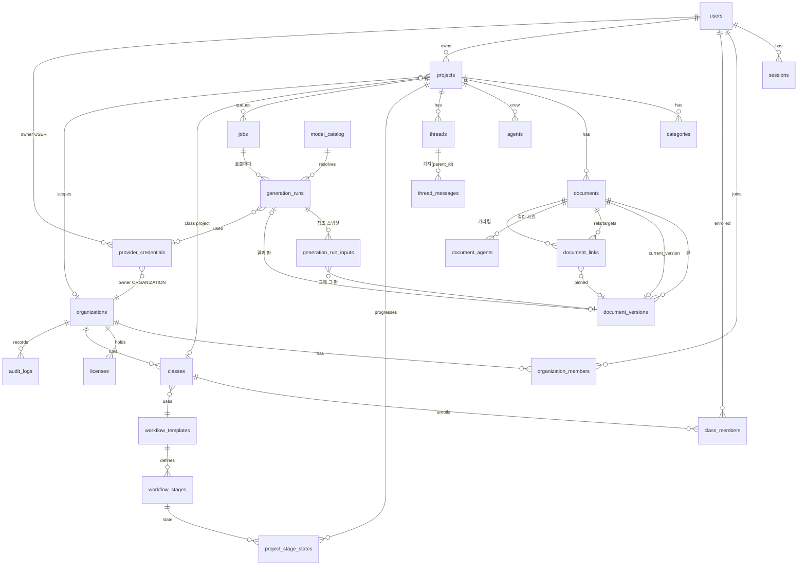

# ERD — 온라인판 데이터 모델 초안

> 상태: **초안 v1 (2026-10-04)** — Phase 3(PostgreSQL) 착수 때 `migrations/001_initial_schema.sql` 로 굳힌다.
> 원칙: 지금 JSON 의 **개념은 바꾸지 않고 저장 위치만 나눈다**(명세 §42). 문서·판·참조·생성 기록은 관계형으로,
> 테넌트 격리는 `organization_id`/`owner_user_id` 로 서버에서 늘 걸고 DB(RLS)로 한 번 더 막는다.

## 1. 관계도 (핵심)



## 2. 공통 규칙

- 기본 키 `id uuid DEFAULT gen_random_uuid()`(PG13+ 내장). 지금의 `p_…`/`d_…` id 는 `legacy_id text` 로 보존(가져오기 매핑·되짚기용).
- 시각 `timestamptz`. 지금의 epoch ms 는 가져올 때 `to_timestamp(ms/1000.0)`.
- 지우기는 **논리 삭제 우선**: 휴지통 = `deleted_at`. 영구 삭제(`purged_at`)도 «생성 기록이 가리키는 판»은 남긴다(명세 §14·부록 N-3).
- 동시 편집 방지: 편집 대상 행에 `row_version int` — `UPDATE … WHERE id=$1 AND row_version=$2`(낙관적 잠금).
- 테넌트 열: 프로젝트 아래 모든 행에 `project_id` 를 두고, 프로젝트에 `organization_id`(개인은 NULL)·`owner_user_id` 를 둔다.
  자주 쓰는 큰 표(`documents`, `jobs`, `generation_runs`, `usage_records`, `audit_logs`)에는 `organization_id` 를 비정규화해 함께 둔다(격리·집계 색인).

## 3. 테이블

### 3-1. 계정 · 기관 · 수업

| 테이블 | 열 | 메모 |
|---|---|---|
| `users` | id · login_id(유일, 소문자) · email(NULL 가능) · display_name · password_hash · status(`active`/`disabled`) · is_platform_admin · created_at · updated_at · last_login_at | 학생은 이메일 없이 login_id(+초대 코드)로 — 개인정보 최소(명세 §34) |
| `sessions` | id · user_id · token_hash(유일, SHA-256) · created_at · expires_at · last_seen_at · ip · user_agent · revoked_at | 쿠키에는 원문 토큰, DB 에는 해시만 |
| `user_identities` | provider(`google`) · subject(구글의 sub) · user_id · email · created_at · last_login_at | migrations/018(2026-10-10, 자유 가입판). PK(provider, subject) — 구글 계정 하나는 우리 계정 하나에. 이메일이 같다고 저절로 잇지 않는다(SECURITY §5-2). 구글로 만든 계정의 `users.password_hash` 는 `'!'`(비밀번호 없음) |
| `oauth_states` | state(PK) · nonce · verifier(PKCE) · mode(`login`/`link`) · user_id(link 때) · created_at | 구글 로그인 시작 한 번에 한 줄 — 10분 · 한 번만(돌아올 때 지운다, 오래된 줄은 다음 시작이 치운다) |
| `organizations` | id · name · slug(유일) · status · settings jsonb(허용 provider·기본 tier·학생 모델 선택 허용·학생 강의 카드·작품 열람 정책·영구삭제 정책) · max_concurrent_jobs · created_at · updated_at | |
| `organization_members` | id · organization_id · user_id · role(`organization_admin`/`instructor`/`student`) · status · created_at | UNIQUE(organization_id, user_id, role). 한 사람이 여러 역할 가능 |
| `licenses` | id · organization_id · plan(`trial`/`education_standard`/…) · status(`active`/`suspended`/`expired`/`revoked`) · starts_at · ends_at · seat_limit · allowed_workflows text[] · allowed_providers text[] · allowed_model_tiers text[] · features jsonb · created_by · created_at · updated_at | AI 사용량이 아니라 **소프트웨어 사용권**(명세 §31·부록 P). AI 작업 때마다 재검증 |
| `classes` | id · organization_id · name · workflow_template_id · status · starts_at · ends_at · created_by · created_at | |
| `class_members` | id · class_id · organization_id · user_id · role(`instructor`/`student`) · joined_at | = 명세의 `enrollments`. UNIQUE(class_id, user_id) |
| `invites` | id · organization_id · class_id · role · code_hash · expires_at · max_uses · used_count · created_by · created_at | 초대 코드 원문은 저장하지 않는다 |

### 3-2. 프로젝트 · 문서 · 판 · 참조 (Core 의 저장)

| 테이블 | 열 | 지금 JSON 에서 |
|---|---|---|
| `projects` | id · owner_user_id · organization_id(NULL=개인) · class_id(NULL) · name · spec jsonb{outline,form,length} · standard · request · model_policy jsonb{provider,tier} · no_count · agent_kind · workflow_template_id · legacy_id · created_at · updated_at · deleted_at | `name` `spec` `standard` `request` `model`→model_policy `noCount` `agents.__kind` |
| `project_members` | project_id · user_id · role(`owner`/`editor`/`viewer`) · created_at | 공동 작업은 후속. 강사의 열람은 수업 멤버십으로 판정 |
| `categories` | id · project_id · name · sort_order · created_at · deleted_at · legacy_id | `categories[]` · 휴지통의 category 항목 |
| `documents` | id · project_id · organization_id · kind(`doc`/`check`/`review`) · category_id · orphan_from_category_id · title · current_version_id · is_final · finalized_at · finalized_by · request · is_material · src · workflow_stage_id · generated_by_run_id · approved_at · approved_by · row_version · created_at · updated_at · deleted_at · deleted_by · purged_at · legacy_id | `docs[]` (`material` → is_material, `orphanFrom` → orphan_from_category_id) |
| `document_versions` | id · document_id · project_id · seq(문서 안 1..n) · title · body · body_sha256 · char_count · source(`user`/`ai`/`restore`/`import`/`system`) · created_by · generation_run_id · created_at | `doc.versions[]` + **현재 본문도 한 판**. UNIQUE(document_id, seq). AI 작업이 쓴 판은 `source='ai'` · 바로 앞의 성공한 부르기(`generation_run_id`)에 잇고, 그 기록의 `result_version_id` 도 이 판을 가리킨다(worker 가 저장에 runId 를 싣는다 — 2026-10-05) |
| `document_links` | id · project_id · source_document_id · target_document_id · role(`reference`/`target`) · pinned_version_id(NULL=늘 현재 판) · sort_order · created_at | `refIds[]` `targetIds[]` — **순서 보존**(sort_order). = 명세의 `document_references` |
| `document_agents` | document_id · agent_id · sort_order | `agentIds[]` — 첫 사람의 모델이 쓰이므로 순서 보존 |
| `agents` | id · scope(`project`/`organization`/`platform`) · project_id · organization_id · name · role · craft · model_policy jsonb · created_at · updated_at · deleted_at · legacy_id | `crew[]`. scope 로 «기관이 준비한 교육용 에이전트»(명세 §53)까지 |
| `project_prompt_layers` | project_id · code · layer(`override`/`generated`) · name · role · task · craft · checksum · updated_at | `prompts{}`(작가 고침) · `agents{code}`(지어진 것). PK(project_id, code, layer) |
| `project_slot_models` | project_id · code · model_policy jsonb | `slotModels{}` |
| `prompt_versions` | id · prompt_key · version · name · role · task · craft · checksum · source(`builtin`/`platform`) · active · created_at | 내장 아홉(`prompts.data.json`)을 v1 로 심는다(명세 §51) |
| `threads` | id · project_id · title · head_message_id · created_at · updated_at · deleted_at · legacy_id | `threads[]` |
| `thread_links` | thread_id · target_document_id · pinned_version_id · sort_order | `thread.refIds[]` |
| `thread_agents` | thread_id · agent_id · sort_order | `thread.agentIds[]` |
| `thread_messages` | id · thread_id · project_id · parent_id · role(`user`/`assistant`) · text · created_by · generation_run_id · created_at · sort_order · legacy_id | `messages[]` — 가지 구조(parent_id) 그대로 |

판에 관한 결정 — **지금은 «직전 판» 배열, 온라인은 «모든 판 + 현재 판 가리킴»**:
- 저장(제목·본문이 바뀔 때)마다 새 `document_versions` 행을 만들고 `documents.current_version_id` 를 옮긴다.
- 화면의 «이력»은 현재 판을 뺀 나머지(지금과 같은 모습). 복원 = 그 판의 내용으로 **새 판**을 만든다(지금과 같은 의미).
- 개수 상한으로 지우지 않는다. 정리는 «어느 생성 기록도 가리키지 않고, 오래되었고, 기관 보존 정책이 허락하는» 판만(명세 §14).

### 3-3. 워크플로우 (Phase 7)

| 테이블 | 열 |
|---|---|
| `workflow_templates` | id · key(`story_creation`) · version · name · description · audience(`education`/`personal`) · active · created_at |
| `workflow_stages` | id · template_id · key · title · order_index · output_type(`document`/`revision`/`selection`/`scene`/`manuscript`/`input`/`final`) · prompt_key · task · default_request · default_model_tier · teaching_note · student_note · required · supports_user_request · supports_persistent_constraint |
| `stage_inputs` | id · stage_id · source_stage_key · input_role(`reference`/`target`/`final`) · required |
| `project_stage_states` | id · project_id · stage_id · status(`not_started`/`ready`/`generating`/`draft`/`needs_revision`/`approved`/`blocked`/`skipped`) · document_id · upstream_changed_at · approved_at · approved_by · updated_at — UNIQUE(project_id, stage_id) |

### 3-4. AI · 작업 · 기록

| 테이블 | 열 | 메모 |
|---|---|---|
| `provider_credentials` | id · owner_type(`user`/`organization`/`platform`) · owner_id · provider(`anthropic`/`openai`/`google`) · label · secret_ciphertext bytea · secret_nonce bytea · secret_tag bytea · key_version · key_hint(끝 4자) · status(`active`/`invalid`/`revoked`) · last_verified_at · last_error_code · created_by · created_at · updated_at · revoked_at | 활성은 (owner_type, owner_id, provider) 당 하나: 부분 UNIQUE. **원문은 어디에도 없다** |
| `model_catalog` | id · provider · tier(`high_reasoning`/`balanced`/`fast`) · model_id · display_name · max_output_tokens · context_window · price_input_per_mtok · price_output_per_mtok · price_cache_read_per_mtok · price_cache_write_per_mtok · currency · active · valid_from · notes | 실제 model id 는 여기에만. 활성은 (provider, tier) 당 하나 |
| `jobs` | id · organization_id · project_id · requested_by · kind · title · target_type · target_id · stage_id · params jsonb · status · step · step_at · ask jsonb · attempt · max_attempts · run_after · priority · locked_by · locked_at · lease_expires_at · heartbeat_at · cancel_requested_at · pause_requested_at · checkpoint jsonb · result jsonb · error_code · error_message_safe · idempotency_key · created_at · started_at · ended_at · dismissed_at | [JOB_SYSTEM.md](JOB_SYSTEM.md). 부분 UNIQUE(project_id, target_id) WHERE status IN 활성 — 명세 §48 |
| `generation_runs` | id · job_id · project_id · organization_id · requested_by · purpose(`update`/`review.member`/`review.merge`/`talk`/`threaddoc`/`agents.kind`/`agents.slot`/`study`/`stage`) · prompt_key · prompt_layer · prompt_checksum · prompt_version_id · workflow_stage_id · target_document_id · thread_id · request_text(문서 요청 스냅샷) · request_once_text · project_request_sha256 · credential_owner_type · credential_owner_id · credential_id · provider · model_tier · model_id · model_source(`pick`/`agent`/`slot`/`stage`/`project`/`org_default`) · status(`running`/`succeeded`/`failed`/`cancelled`) · error_code · error_message_safe · finish_reason · started_at · ended_at · elapsed_ms · input_tokens · output_tokens · cache_read_tokens · cache_write_tokens · reasoning_tokens · cost_usd · cost_source(`provider`/`estimated`) · provider_request_id · prompt_sha256 · result_version_id · result_message_id | **한 행 = 한 번의 provider 호출**(합평 패널이면 여러 행). 명세 §11·부록 J |
| `generation_run_inputs` | id · run_id · role(`material`/`final`/`target`/`reference`/`extra`/`talk`/`agent`) · document_id · document_version_id · agent_id · title · content_sha256 · char_count · sort_order | **참조 스냅샷** — «세계관 V7 을 보았다»(명세 §13·부록 N-1). 가리킨 판은 지우지 않는다(FK RESTRICT) |
| `prompt_snapshots` | run_id · system_prompt · user_prompt · created_at · expires_at | 선택. 원문 입력 보관은 **보존 정책**(기관 설정)이 허락할 때만(명세 §13 끝) |
| `usage_records` | id · run_id · organization_id · user_id · project_id · provider · model_id · input_tokens · output_tokens · cache_read_tokens · cache_write_tokens · cost_usd · recorded_at | 집계용 장부(기관·월·모델별). 학생 화면에는 내보내지 않는다 |
| `audit_logs` | id · at · actor_user_id · actor_role · organization_id · action · target_type · target_id · ip · user_agent · details jsonb(가린 값만) | 로그인·권한 변경·기관 생성·라이선스·credential·삭제/복구(명세 §61) |
| `file_objects` | id · organization_id · project_id · storage_key · original_name · content_type · byte_size · sha256 · extracted_document_id · created_by · created_at · deleted_at | 업로드 원본은 Object Storage, 추출 텍스트는 자료 문서로 |

### 3-5. 이용권 — 자유 가입판의 월 이용료(migrations/015, 2026-10-09)

AI 비용(본인 키 — `generation_runs` · `usage_ledger`)과 **섞지 않는다**(원칙 7) — 이 표들은 생성 기록과 잇지 않는다. 교육기관판에서는 비어 있다. 설계: [OPEN_EDITION.md](OPEN_EDITION.md) §4-4 · §4-6.

| 테이블 | 열 | 메모 |
|---|---|---|
| `billing_refs` | kind(`link`/`email`) · ref · user_id · plan_id · created_at · used_at | PK(kind, ref). `link` = [결제하기]마다 새로 짓는 무작위 참조값(결제창 `?ref=`) — 그로블이 그 정기결제의 모든 소식에 같은 값을 돌려주므로 **참조값 하나 = 정기결제 하나**. `email` = 운영자가 [이 계정에 연결]로 이어 준 구매자 이메일 |
| `billing_plans` | id · name · checkout_url · price · cycle_months · product_id · enabled · sort_order · created_at · updated_at | 결제 옵션. 가격 · 주기는 만든 뒤 바꾸지 않는다(새 줄 · 옛 줄 끄기). 꺼진 줄도 옛 구독자의 갱신을 맞춰 본다 |
| `subscriptions` | id · user_id · provider(`groble`/`manual`/`trial`) · ref · status(`active`/`past_due`/`cancel_pending`/`ended`) · paid_until · next_billing_date · service_ends_at · final_failure · occurred_at · plan_id · last_paid_at · last_amount · created_at · updated_at | UNIQUE(user_id, provider, ref) — 정기결제마다 한 줄 · 운영자 연장 · 가입 체험. **쓸 수 있는가 = paid_until > now() 인 줄이 있는가**(또는 무료 이용 · 운영자). `occurred_at` 보다 이르거나 같은 소식은 기록만 |
| `billing_events` | id · provider · idem_key · event_id · type · occurred_at · received_at · ref · merchant_uid · amount · user_id · subscription_id · result · note · review · resolved_by · resolved_at · raw jsonb | UNIQUE(provider, idem_key) — 같은 `X-Groble-Idempotency-Key` 는 한 번만. `raw` 는 받은 원문(이름 · 이메일 · 전화 — 운영 화면에서 가려서). `review` = «확인 필요» |
| `billing_customers` | user_id · free · memo · updated_by · updated_at | 무료 이용(운영자가 주는 계정) · 운영 메모 |
| `app_settings` | key · value jsonb · updated_by · updated_at | `billing.rules` = { trialDays(기본 0), graceDays(기본 10), refundDays(기본 7 — 구독 시작부터), refundNoUse(기본 false — 2026-10-10 ②), notifyEmail(알림 메일, 기본 빈 값) } |
| `refund_requests` | id · user_id · subscription_id · merchant_uid · amount · paid_at · deadline · ai_runs · in_policy · prev_paid_until · source(`user`/`groble`) · status(`open`/`done`/`withdrawn`) · refunded_at · cancelled_at · resolved_by · resolved_at · created_at | migrations/017(2026-10-10) · 019 에서 reason · detail(고른 이유 · 적은 말) · mailed_at · mail_error(운영자 알림 메일) 더함. 환불 한 건 = 결제 하나 — **그때의 판정 근거**(결제 때 · 기한 · 결제 뒤 AI 작업 수 · 규정 안인가)와 할 일 둘(그로블 환불 `refunded_at` · 그로블 정기결제 해지 `cancelled_at`)의 확인. 둘 다 되면 `done`. `prev_paid_until` 은 [요청 되돌리기]가 이용권을 되살릴 값. 그로블에서 먼저 환불하면 `source='groble'` 로 생긴다. 설계: OPEN_EDITION §4-8 |
| `cancel_requests` | id · user_id · subscription_id · reason · detail · next_billing(date) · status(`open`/`done`/`withdrawn`) · confirmed_at · charged_at · mailed_at · mail_error · resolved_by · resolved_at · created_at | migrations/019(2026-10-10 ②). [구독 취소] 한 건 — 이유와 그때의 다음 결제일(이 날 전에 그로블에서 해지). 그로블 해지 웹훅이 오면 `confirmed_at` · `done`, 접수 뒤 갱신 결제가 오면 `charged_at`(환불할 것). 그로블에 판매자 해지 API 가 없어 해지는 운영자가 그로블에서 |

## 4. 핵심 색인 · 제약

```sql
-- 활성 작업은 대상 하나에 하나뿐 (지금의 isTargetRunning 을 DB 가 지킨다)
CREATE UNIQUE INDEX jobs_one_active_per_target ON jobs (project_id, target_id)
  WHERE status IN ('queued','running','paused','waiting_for_user') AND target_id IS NOT NULL;
-- 같은 요청 두 번(더블클릭·재전송) 방지
CREATE UNIQUE INDEX jobs_idempotency ON jobs (requested_by, idempotency_key) WHERE idempotency_key IS NOT NULL;
-- worker 가 집어 갈 순서
CREATE INDEX jobs_claim ON jobs (status, run_after, priority DESC, created_at) WHERE status = 'queued';
-- 판 번호
CREATE UNIQUE INDEX document_versions_seq ON document_versions (document_id, seq);
-- 활성 credential 하나
CREATE UNIQUE INDEX credentials_one_active ON provider_credentials (owner_type, owner_id, provider) WHERE status = 'active';
-- 테넌트 조회
CREATE INDEX documents_project ON documents (project_id) WHERE deleted_at IS NULL;
CREATE INDEX projects_org ON projects (organization_id, owner_user_id);
CREATE INDEX runs_org_time ON generation_runs (organization_id, started_at);
```

## 5. 테넌트 격리 (서버 + DB 두 겹)

1. **서버(1차)**: 모든 요청이 `세션 → 사용자 → (프로젝트) → 접근 규칙` 을 지난다. 규칙은 한 곳(`online/tenancy`)에만 있다.
   - 개인 프로젝트: `owner_user_id = 나`.
   - 기관 프로젝트: 학생 = 소유자만 · 강사 = 그 수업(`class_members`)의 학생 프로젝트 읽기 · 기관 관리자 = 기관 정책이 허락한 범위 · 플랫폼 관리자 = 운영에 필요한 최소.
   - 클라이언트가 보낸 `pid` 는 «요청»일 뿐이다. 서버가 위 규칙으로 다시 판정한다(명세 §30 «B 학교 학생이 A 학교 id 를 넣어도 못 본다»).
2. **DB(2차, Phase 4)**: PostgreSQL RLS — 트랜잭션마다 `SET LOCAL app.user_id`/`app.org_ids` 를 걸고 `projects` 이하 표에 정책을 둔다.
   → 구현(2026-10-07, migrations/014): 작품 내용을 «사람의 눈으로» 읽는 길(`/api/state` · 내려받기 — `store.getAs`)은 한 트랜잭션 안에서
   `SET LOCAL ROLE se_reader` + `app.user_id` 로 읽는다. `se_reader` 에는 작품 · 문서 · 판 · 참조 · 카테고리 · 에이전트 · 스레드 · 휴지통 등 14표에
   SELECT 정책(`se_can_read` — tenancy 의 «읽기»와 같은 규칙)만 있고 쓰기 권한은 없다. 쓰기 길 · worker 는 표의 주인으로 돌아 RLS 를 지나간다(FORCE 없음).
   역할을 만들 권한이 없는 DB 면 마이그레이션이 그냥 지나가고 앱은 1차 판정만으로 돈다(`store.readerOn()` 이 false). 시험: `online/test.rls.mjs`.
   → 복사해도 서게(2026-10-09, migrations/016): 정책 · 읽기(SELECT) 권한을 역할 이름 대신 PUBLIC 에 건다 — 행은 정책이 거르므로(`app.user_id` 없이는 0행) 새로 열리는 것은 없고,
   DB 를 다른 곳에 복사(pg_dump → pg_restore, Replit 의 개발 → 운영 복사)해도 `role "se_reader" does not exist` 로 멈추지 않는다.
   역할 `se_reader` 는 DB 밖(클러스터)의 것이라 복사본에 실리지 않는다 — `online/migrate.mjs` 가 켤 때마다 세우고 그 역할로 바꿀 권리를 준다
   (PostgreSQL 16 은 역할을 만든 이에게 ADMIN 만 준다 — `store.readerOn()` 은 멤버인지 묻지 않고 정말 바꿔 본다). 시험: `online/test.mjs`(정책 · 권한이 주인과 PUBLIC 말고는 부르지 않는다).
   worker 는 작업의 프로젝트 하나로 범위를 좁힌 같은 방식으로 붙는다.

## 6. 지금 JSON → 표 대응(요약)

| JSON | 표 |
|---|---|
| `project.{name,spec,standard,request,noCount}` | `projects` |
| `project.model` / `crew[].model` / `slotModels` | `projects.model_policy` / `agents.model_policy` / `project_slot_models` (`opus`→`{provider:'anthropic', alias:'opus'}` — 온라인 tier 매핑은 [MIGRATION.md](MIGRATION.md)) |
| `project.prompts` / `project.agents` | `project_prompt_layers`(override / generated) · `projects.agent_kind` |
| `docs[]` + `versions[]` | `documents` + `document_versions`(직전 판들 + 현재 판) |
| `refIds` / `targetIds` / `agentIds` | `document_links`(reference/target, 순서) / `document_agents` |
| `categories[]` | `categories` |
| `threads[]` + `messages[]` | `threads` + `thread_messages` + `thread_links` + `thread_agents` |
| `trash[]` | `trash_entries`(언제 · 어느 기능 · 무엇 · 되살릴 짐) + 원래 표의 `deleted_at`(영구 삭제는 `purged_at` — 행은 남는다) |
| `jobs[]` | `jobs`(끝난 기록만, 선택) |
| `data/auth.json` | **옮기지 않는다**(평문 키) — 사용자가 온라인에서 다시 연결 |
