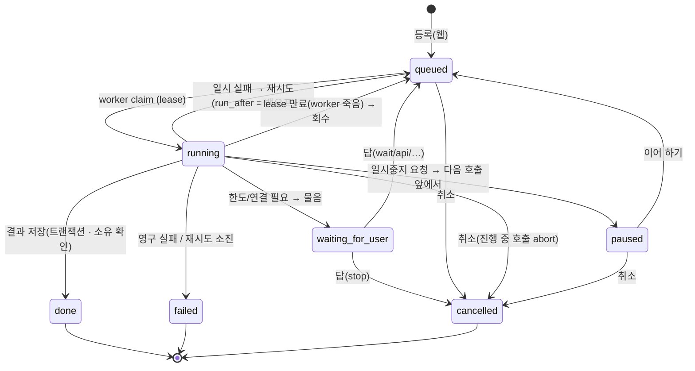

# Job / Worker 전환안

> 상태: **설계 초안 v1 (2026-10-04)**. 구현은 Sprint 9(Phase 6). 개인판의 작업 실행기(`tools/jobs.mjs`)는 그대로 남는다.

## 1. 지금 무엇이 되고 무엇이 안 되나

| 되는 것(지킨다) | 안 되는 것(온라인에 필요) |
|---|---|
| HTTP 를 붙잡지 않는다 — 등록 즉시 `jobId` | 상태·손잡이가 메모리에만 → 재시작하면 «중지됨»(`healStale`) |
| «지금 하는 일 · 지난 시간» 한 줄 | 여러 프로세스/서버가 같은 큐를 나눌 수 없다 |
| 일시중지 = 돌던 호출은 끝까지, **다음 호출 앞에서** 선다 | 자동 재시도·백오프 없음(한 번 다시 부르기뿐) |
| 한도에 닿으면 죽지 않고 물음(`wait`/`api`/`stop`) — 같은 호출부터 다시 | 동시성 상한은 전역 하나(`MAX_CALLS=3`) — 기관별·provider 별 없음 |
| 한 대상에 작업 하나(`isTargetRunning`) | 작업이 클로저 — 다른 프로세스가 이어받을 수 없다 |
| 실패해도 기존 문서는 그대로(결과는 끝에 한 번 쓴다) | 생성 기록(usage·참조 스냅샷)이 남지 않는다 |

## 2. 바꾸는 핵심: 작업 = 데이터

지금 `jobs.start(pid, { kind, title, targetId, run: (ctx) => … })` 는 **클로저**를 받는다. 이것을 «종류 + 매개변수»로 바꾼다.

```js
// core/generation/kinds.mjs — 개인판 실행기와 온라인 worker 가 함께 쓰는 작업 종류 표
export const JOB_KINDS = {
  agents:    { title: (p) => '에이전트 준비', run: (ctx, { request }) => prepareThenStudy(ctx, request) },
  update:    { target: 'document', run: (ctx, { docId, modelPick, requestOnce }) => runUpdate(ctx, docId, { modelPick, requestOnce }) },
  talk:      { target: 'thread',   run: (ctx, { threadId, askedId, modelPick }) => runTalk(ctx, threadId, askedId, { modelPick }) },
  threaddoc: { target: 'thread',   run: (ctx, { threadId, request, modelPick }) => runThreadDoc(ctx, threadId, request, { modelPick }) },
  stage:     { target: 'document', run: (ctx, { stageKey, docId, … }) => runStage(ctx, …) },   // Phase 7
};
```

- 개인판: `jobs.start(pid, { kind, params })` → 같은 프로세스에서 `JOB_KINDS[kind].run`. 사용자가 보는 동작은 그대로.
- 온라인: 웹은 `INSERT jobs(kind, params)` 만, worker 가 `JOB_KINDS[kind].run` 을 돈다.
- **사용자 입력은 작업 전에 저장한다**: 지금 `runTalk` 은 작업 안에서 «작가의 말»을 얹는다 → 온라인은 웹 요청에서 말을 먼저 저장하고(명세 부록 AQ «AI 호출보다 먼저 저장»), 작업은 `askedId` 에 답만 단다.

## 3. 상태 기계



- 화면 표시 대응(지금 말을 지킨다): `queued`=«대기 중», `running`=지금 하는 일·지난 시간, `paused`=«멈춤», `waiting_for_user`=«구독 한도 · 몇 시에 풀림»/«연결 필요», `done`=«완료», `failed`=«실패 — 까닭», `cancelled`=«중지됨».
- 지금의 `stopped` 는 온라인의 `cancelled` 다(가져오기 때 이름만 바꾼다).

## 4. 테이블과 claim

`jobs` 열은 [ERD.md](ERD.md) §3-4. 핵심만:

```sql
-- worker 가 하나를 집는다 — 같은 행을 두 worker 가 잡지 않는다
WITH next AS (
  SELECT id FROM jobs
   WHERE status = 'queued' AND run_after <= now()
     AND (organization_id IS NULL OR organization_id NOT IN (SELECT organization_id FROM org_saturated))   -- 기관 동시 상한
   ORDER BY priority DESC, created_at
   FOR UPDATE SKIP LOCKED
   LIMIT 1)
UPDATE jobs j
   SET status = 'running', locked_by = $worker, locked_at = now(), heartbeat_at = now(),
       lease_expires_at = now() + interval '90 seconds', attempt = attempt + 1, started_at = coalesce(started_at, now())
  FROM next WHERE j.id = next.id
RETURNING j.*;
```

- **lease + heartbeat**: 도는 동안 worker 가 15초마다 `heartbeat_at`·`lease_expires_at` 을 민다. 그 김에 `cancel_requested_at`·`pause_requested_at` 을 읽어 온다.
- **회수(reaper)**: `status='running' AND lease_expires_at < now()` → 시도가 남았으면 `queued`(백오프), 아니면 `failed`(`worker_lost`). 체크포인트가 있으면 거기서 잇는다.
- **결과 저장은 울타리(fencing)와 함께**: 저장 트랜잭션에서 `WHERE id=$job AND locked_by=$me AND status='running'` 이 맞을 때만 판을 만들고 `done` 으로 바꾼다.
  lease 를 잃은 «좀비 worker» 가 나중에 돌아와도 결과를 덮어쓰지 못한다.
- **중복 방지**: `jobs_one_active_per_target`(대상 하나에 활성 작업 하나) + `idempotency_key`(같은 클릭 두 번). 명세 §48.

## 5. 재시도 · 시간 · 취소

| 갈래 | 자동 재시도 | 백오프 |
|---|---|---|
| `rate` · `overloaded` | 최대 4회 | 10s → 30s → 90s → 270s (± 지터), provider 의 `retry-after` 가 있으면 그것 |
| `timeout` · `other` · `worker_lost` | 1회 | 30s |
| `auth` · `credit` · `model` · `invalid` · `safety` · `empty` · `prompts` | 없음 → `failed` | — |
| `quota-*`(CLI) · `credential_missing` | 없음 → `waiting_for_user` | 사람이 답할 때까지 worker 를 붙잡지 않는다 |

- 호출 시간 상한: 지금과 같은 뜻의 `CALL_TIMEOUT`(기본 30분). 작업 전체 상한: `JOB_MAX_DURATION`(기본 2시간) — 넘으면 `failed(timeout)`.
- 취소: `cancel_requested_at` 을 찍으면 worker 가 heartbeat 때 보고 진행 중 HTTP 를 `AbortController` 로 끊는다. 결과는 버리고 문서는 그대로.
- 일시중지: `pause_requested_at` → worker 는 **돌던 호출을 끝까지 하고**(지금 약속 그대로) 다음 호출 앞(`ctx.gate()`)에서 체크포인트를 저장하고 `paused` 로 내려놓는다. 이어 하기 = `queued`.

## 6. 체크포인트 — 여러 호출로 된 작업

합평 패널(사람마다 1회 + 모으기 1회)·에이전트 준비(판정 + 자리 일곱 + 자료 분석)는 호출이 여럿이다.
지금은 `said[]` 가 메모리에 있어 재시작하면 처음부터다. 온라인은 호출 하나가 끝날 때마다 `jobs.checkpoint` 에 남긴다.

```text
review panel : { said: [{ agentId, name, runId, text }], next: 'member'|'merge' }
agents       : { kind: '소설'|…, slotsDone: ['S02','F-UPDATE',…], studyDone: false }   // 지어진 자리는 이미 프로젝트에 저장됨 — 지금도 «건너뛴다»
```

재시도·회수·이어 하기는 체크포인트부터 잇는다 → 명세 부록 Z 시나리오 4 «중간 결과가 있다면 복구».

## 7. 동시성

- worker 프로세스 하나에 **동시 슬롯 N**(`WORKER_CONCURRENCY`, 기본 4). 파일럿 10~20명 → 측정 → 조정(명세 0-D).
- 기관별 상한 `organizations.max_concurrent_jobs`(기본 5): 넘치면 그 기관 작업은 `queued` 로 기다린다(학생 화면에는 «대기 중»만, 숫자는 보이지 않음).
- provider/credential 별 상한: 429 를 자주 받는 credential 은 짧게 쉬게 한다(메모리의 토큰 버킷 — worker 하나일 때는 충분).
- 지금의 `MAX_CALLS`(개인판 CLI 고삐)는 개인판에 그대로 둔다.

## 8. 깨우기와 DB 비용 — «쉴 때는 DB 를 두드리지 않는다»

Replit production DB 는 Neon 기반이고 **요청이 없으면 5분 뒤 잠든다**(깨어 있는 시간만 과금 — [REPLIT_DEPLOYMENT.md](REPLIT_DEPLOYMENT.md) §5).
worker 가 몇 초마다 큐를 SELECT 하면 DB 가 24시간 깨어 있어 고정비가 된다(대략 월 수십~백 달러대). 그래서:

1. 웹과 worker 가 **같은 VM**(같은 배포)에 있을 때: 웹이 작업을 넣고 곧바로 worker 에 IPC 로 «일 있음»을 알린다 → worker 는 그때만 claim.
2. 도는 작업이 있을 때만 heartbeat·회수 검사를 한다. 아무것도 없으면 긴 간격(예: 10분)의 안전망 확인만.
3. worker 가 여러 대가 되면 PostgreSQL `LISTEN/NOTIFY` 로 바꾼다(코드 경로는 같고 «깨우는 수단»만 다르다).

## 9. 서버 재시작 · 배포 시

- 웹 재시작: 작업은 DB 에 있으므로 영향 없음. 화면은 폴링으로 그대로 이어 본다.
- worker 재시작: `SIGTERM` 을 받으면 새로 집지 않고, 돌던 호출에 **유예 시간**(예: 25초)을 준다 → 못 끝내면 `queued` 로 돌려놓고 끝낸다(체크포인트 보존).
  비정상 종료면 lease 만료 후 reaper 가 회수한다. 어느 쪽이든 **작품은 잃지 않는다**(결과는 끝에 트랜잭션으로만 쓴다).

## 10. 화면과 교육 UX 연결

- 작업 줄은 지금처럼 «지금 하는 일 · 지난 시간»(`step`, `step_at`). 남은 시간·백분율은 만들지 않는다.
- 작업이 워크플로우 단계(`stage_id`)를 알면 → 강사 화면에 그 단계의 `teaching_note`, (허락 시) 학생 화면에 미니 강의 카드.
- 강사 화면: 수업 전체 작업 현황(대기·진행·실패) — 명세 §50.

## 11. 관측(관리자)

`admin.jobs`: 상태별 수 · 오래 기다리는 작업 · 실패 갈래 상위 · 평균/단계별 처리 시간 · provider 오류율 · 재시도 수 — 명세 0-Q·부록 AR.

## 12. 시험

중복 등록 거절 · 두 worker 동시 claim(한 행은 한 번만) · lease 만료 회수 · 좀비 worker 저장 거절(울타리) · 취소(진행 중 abort) ·
일시중지(다음 호출 앞에서 섬) · 체크포인트에서 잇기 · 백오프 순서 · 영구 실패 즉시 종료 · 재시작 후 복구 · 여러 학생 동시 작업 · 기관 상한.
DB 가 필요한 시험은 `DATABASE_URL_TEST` 가 있을 때만 돈다([TEST_PLAN.md](TEST_PLAN.md)).
